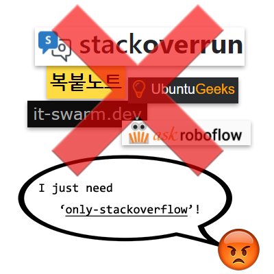

# only-stackoverflow

- [README (english)](README-en.md)

- 검색 결과에서 스택오버플로 사이트 긁어다가 번역기 돌려놓은 이상한 사이트들을 모조리 숨겨요

- [구글](https://google.co.kr)과 [덕덕고](https://duckduckgo.com/)를 지원해요.

- 이슈/풀리퀘 매우 환영
    - 아래의 2 파일만 수정해주세요. `only-stackoverflow.txt` 파일은 자동으로 생성됩니다.
        - [`build.bash`](build.bash)
        - [`hosts.txt`](hosts.txt)

## [only-stackoverflow 필터 구독하기](https://subscribe.adblockplus.org/?location=https://github.com/RyuaNerin/only-stackoverflow/raw/master/only-stackoverflow.txt&title=only-stackoverflow)

- **테스트된 플러그인**
    - **Adguard**
    - **uBlock Origin**
    - **Personal Blocklist(not by Google)**
    - **Adblock Plus**
    - **AdBlock**

- Adblock Plus, AdBlock 사용시 주의사항
    - (Adblock Plus) "허용되는 광고"를 허용하거나 (AdBlock) "허용할만한 광고" 필터를 구독하면 google.com에서 모든 필터가 적용되지 않습니다. 이를 해제해야 합니다.

## [차단하는 사이트 목록](hosts.txt)

## License

- [Creative Commons Attribution 4.0 International License.](https://creativecommons.org/licenses/by/4.0/)
